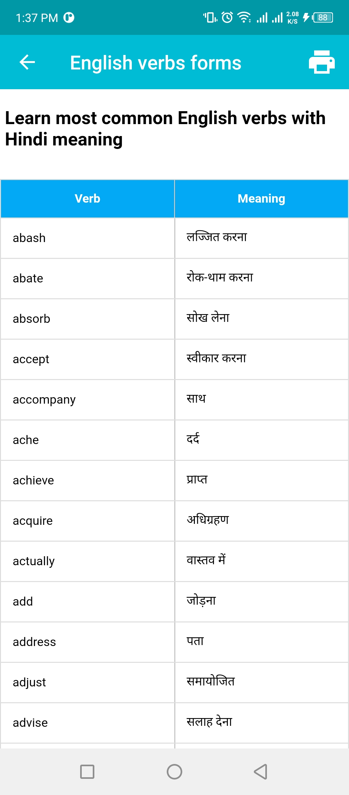
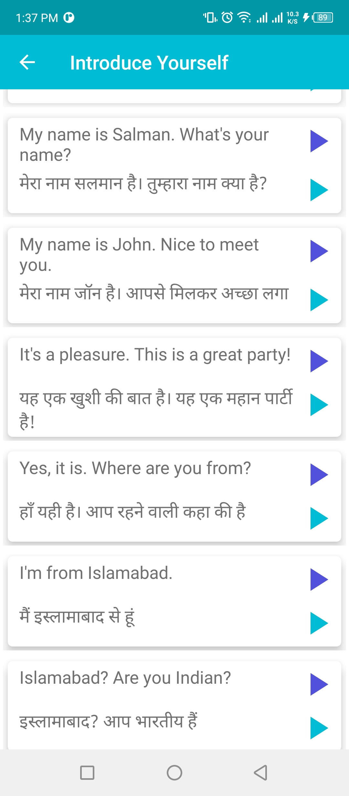

# Hindi dictionary and translator
A complete Hindi dictionary and translator app developed in Java (android) using the following:
- Aws translation
- Sqlite
- Restful api`s

  
  
  
  
  
  
  
  
  
  
  

